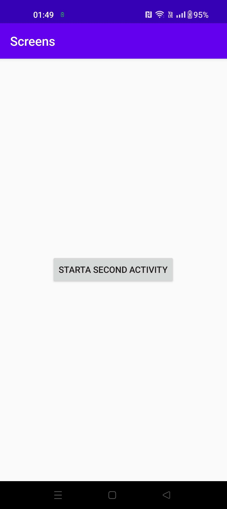
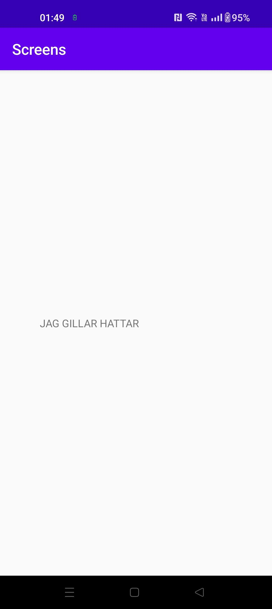

# Rapport

I denna uppgift så användes Extra för att skicka information mellan aktiviteter. 
Från aktivitet 1 skickades en mening som sedan skrevs ut i aktivitet 2.
Detta triggades genom en knapp som fans på activity_main
Funktionen för att skicka informationen sattes in i MainActivity.java och funktionen för att ta emot informationen sattes i secondActivity.java

Send on button press i MainActivity.java
```
    protected void onCreate(Bundle savedInstanceState) {
        super.onCreate(savedInstanceState);
        setContentView(R.layout.activity_main);

        button = (Button) findViewById(R.id.button);
        button.setOnClickListener(new View.OnClickListener() {

            public void onClick(View v) {
                openSecondActivity();
            }
        });
    }
    public void openSecondActivity(){
        Intent intent = new Intent(this, secondActivity.class);
        intent.putExtra("name","JAG GILLAR HATTAR");
        startActivity(intent);
    }
```

Ta emot data i secondActivity.java
```
    protected void onCreate(Bundle savedInstanceState) {
        super.onCreate(savedInstanceState);
        setContentView(R.layout.activity_second);

        // on below line we are initializing variables with ids.
        TextView name = findViewById(R.id.name);

        // on below line we are setting our message to our text view.
        name.setText(getIntent().getStringExtra("name"));
    }
```
Bild på main activity


Bild på second activity

